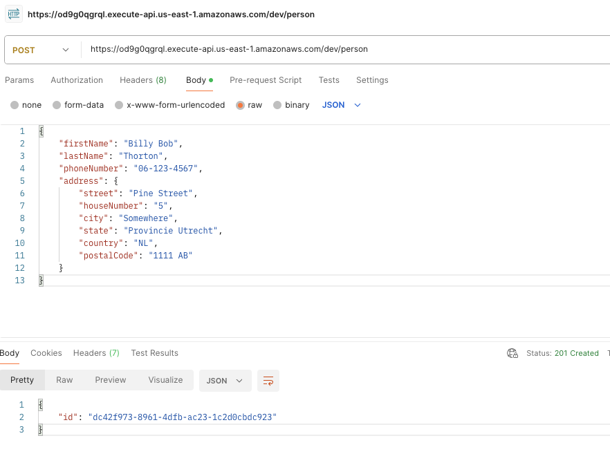
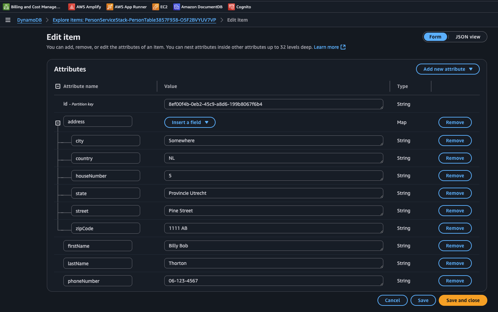

# Serverless Assignment - Tikkie Person Endpoint

This was an interesting assignment, as I'd never worked on serverless stuff, nor AWS CDK. I've written one lambda function previously, but that was a custom JWT authorizer for AWS' API Gateway (not really applicable, imo).

### Architecture
- Scaffolding done with `cdk init`
- OpenAPI
- API Gateway
- Lambda (TypeScript)
- DynamoDB
- AWS CDK (IaC & deployment & scaling)
- AWS SAM (local dev & testing)

### A Word on Scaling
Since this is serverless, most of the scaling is handled automatically. Specifically:
- API Gateway is fully managed by AWS and targets don't need to be specified
- DynamoDB is spec'd as `PAY_PER_REQUEST`, which is fully managed by AWS
- Lambda has a max concurrency threshold, and minimum and maximum replica counts set. These values can be tweaked in the environment file.

### Reflection & Improvements
1. The most challenging part of the assignment was learning AWS CDK and SAM - tools I've never used before. There's a decent amount to unpack under the hood, and it didn't play so well with the runtime validation library I choose (typia). However, this is more pilot error, than anything.
1. The lambda could be rewritten to be idempotent - this an especially important consideration when dealing with financial information; I guess we'd want "eventual consistency" between the db and the event. As it stands, it's not that, but rather a bunch of try/catch statements with a modicum of error handling.
1. Development environment is perhaps a bit overkill, but it was a learning experience with lambda and these tools.

### Development

#### Prerequisites (Steps)
1. [Docker](https://www.docker.com/)
1. Get [NodeJS](https://nodejs.org/en/download)
1. NVM (NodeJS is distributed using NVM now, so you should have it)
1. [AWS CLI](https://docs.aws.amazon.com/cli/latest/userguide/getting-started-install.html), [AWS CDK](https://www.npmjs.com/package/aws-cdk), & [AWS SAM](https://docs.aws.amazon.com/serverless-application-model/latest/developerguide/prerequisites.html) (I assume these are setup, configured, and bootstrapped). If not, please see:
    - [Setting up the AWS CLI](https://docs.aws.amazon.com/cli/latest/userguide/getting-started-quickstart.html)
    - [Tutorial: Create your first AWS CDK app (Steps 2 & 3)](https://docs.aws.amazon.com/cdk/v2/guide/hello-world.html#hello-world-configure)
1. `cd` into _this_ - root - directory and execute `nvm install && nvm use`
1. Continue to "Environment Variables"


##### Environment Variables

1. execute `npm run init`
    - this handles dependency install and duplicates the `env.template` for you to modify
1. Input the necessary key/ids in the newly created `.env` file(s). You should only need to update `CDK_DEFAULT_ACCOUNT=""` with your AWS account number.
1. You're now ready to Run, Test, and Deploy the project!

#### Interacting with this project
This project is deployed - you can send it a request if you'd like:
```shell
// Request
curl -X POST "https://ert3pqshp9.execute-api.us-east-1.amazonaws.com/prod/person" \
     -H "Content-Type: application/json" \
     -d '{
       "firstName": "Billy Bob",
       "lastName": "Thorton",
       "phoneNumber": "06-123-4567",
       "address": {
         "street": "Pine Street",
         "houseNumber": "5",
         "city": "Somewhere",
         "state": "Provincie Utrecht",
         "country": "NL",
         "postalCode": "1111 AB"
       }
     }'

// Response
201 -> {"id":"8ef00f4b-0eb2-45c9-a8d6-199b8067f6b4"}
```

##### Result:
*Postman Request*


*DynamoDB*



#### Running this project

##### Local development

You've got a 2 options:

1. You can run the lambda with a valid event payload by executing this command:
    ```shell
    npm run sam:invoke
    ```
1. You can run a mocked stack (lambda, api gateway, dynamodb) by executing:
    ```shell
    npm run local:dev

    # now you can invoke it:
    curl -X POST "http://127.0.0.1:3000/person" \
     -H "Content-Type: application/json" \
     -d '{
       "firstName": "Billy Bob",
       "lastName": "Thorton",
       "phoneNumber": "06-123-4567",
       "address": {
         "street": "Pine Street",
         "houseNumber": "5",
         "city": "Somewhere",
         "state": "Provincie Utrecht",
         "country": "NL",
         "postalCode": "1111 AB"
       }
     }'
    ```
    Note, this doesn't support live-reload.

##### Testing

You can run tests locally with the following command:
```shell
npm run test
```

#### Deploying this project

If you've made any changes to the _Person_ or _Address_ interfaces, you must re-generate the OpenAPI spec. You can do this by running this command:
```shell
npm run generate-openapi
```

To deploy the project on AWS, all you need to do is run:
```shell
npm run deploy
```

This builds the lambda, and handles provisioning/creating resources on AWS.
The lambda is built "manually" due to esbuild packaging issues (AWS CDK) with _typia_ (a library used for runtime validation).

#### Destroying all resources
execute this command:
```shell
cdk destroy
```
